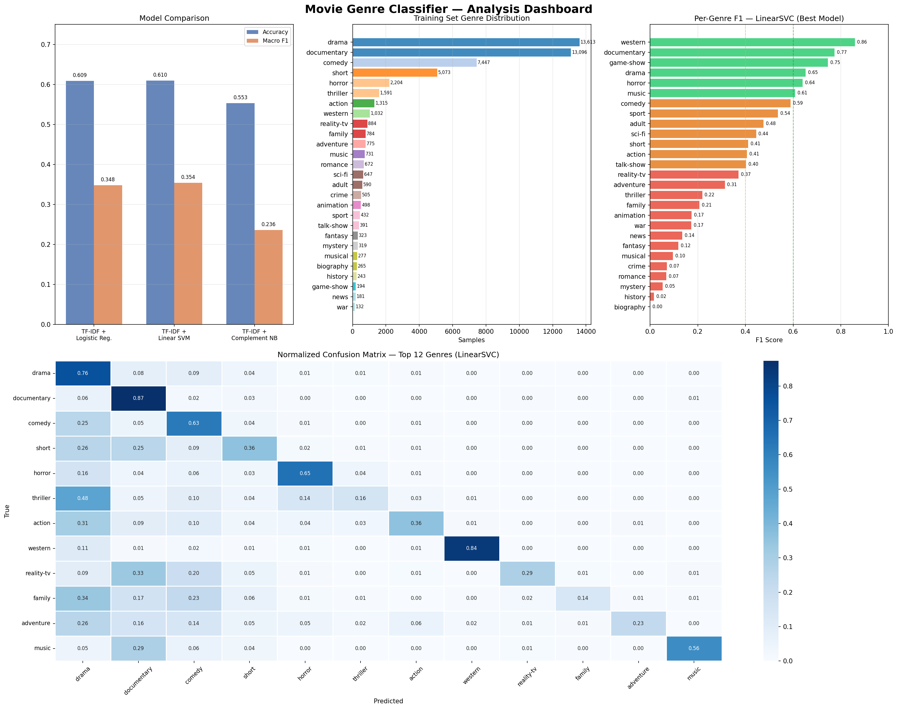

# 🎬 CineGenre AI — Movie Genre Classifier

> *"Give me a plot. I'll tell you the genre."*

A machine learning system that predicts the genre of a movie from its plot summary alone — trained on **54,000+ real films** from the IMDb database using classical NLP techniques.

---

## 📌 Table of Contents

- [Overview](#overview)
- [Demo](#demo)
- [Dataset](#dataset)
- [Approach](#approach)
- [Models & Results](#models--results)
- [Project Structure](#project-structure)
- [How to Run](#how-to-run)
- [Key Findings](#key-findings)
- [Future Work](#future-work)
- [Author](#author)

---

## Overview

This project tackles **multi-class text classification** — one of the core problems in Natural Language Processing. Given only the plot description of a movie, the model must classify it into one of **27 genres** such as drama, comedy, thriller, sci-fi, western, documentary, and more.

The challenge: genres like *romance*, *drama*, and *mystery* share overlapping language, while rare genres like *biography* or *war* have very few training examples.

---

## Demo

```python
from genre_predictor import predict_genre

predict_genre(
    title="Shadow of the Killer",
    plot="A relentless detective hunts a masked serial killer who leaves 
          cryptic clues at each crime scene, leading to a terrifying 
          final confrontation."
)
# → THRILLER ✅

predict_genre(
    title="Space Odyssey 2099",
    plot="A crew of astronauts travels through a wormhole to find a new 
          habitable planet as Earth faces ecological collapse."
)
# → SCI-FI ✅
```

---

## Dataset

| Split | Samples | Source |
|-------|---------|--------|
| Training | 54,214 | IMDb via FTP (fu-berlin.de) |
| Test | 54,200 | IMDb via FTP (fu-berlin.de) |

**Format:**
```
ID ::: TITLE ::: GENRE ::: DESCRIPTION   (train)
ID ::: TITLE ::: DESCRIPTION             (test)
```

**27 Genres covered:**
`action` · `adult` · `adventure` · `animation` · `biography` · `comedy` · `crime` · `documentary` · `drama` · `family` · `fantasy` · `game-show` · `history` · `horror` · `music` · `musical` · `mystery` · `news` · `reality-tv` · `romance` · `sci-fi` · `short` · `sport` · `talk-show` · `thriller` · `war` · `western`

> ⚠️ **Class Imbalance:** Drama (13,613 samples) vs. Biography (264 samples) — a 50× gap that makes minority genre prediction challenging.

---

## Approach

### Pipeline

```
Raw Text
   ↓
Text Cleaning (lowercase, remove punctuation/numbers)
   ↓
Feature Engineering (Title + Description concatenated)
   ↓
TF-IDF Vectorization (unigrams + bigrams, 50K features)
   ↓
Classifier (LinearSVC / Logistic Regression / Complement NB)
   ↓
Predicted Genre
```

### Why TF-IDF + LinearSVC?

- **TF-IDF** captures how *uniquely* a word identifies a genre across the corpus (e.g. "gunslinger" → western, "spacecraft" → sci-fi)
- **Bigrams** catch phrases like "serial killer", "outer space", "love story"
- **Sublinear TF scaling** prevents very long descriptions from dominating
- **LinearSVC** is fast, memory-efficient, and excels at high-dimensional sparse text features — ideal for this problem

---

## Models & Results

| Model | Test Accuracy | Macro F1 | Training Time |
|-------|:-------------:|:--------:|:-------------:|
| **Linear SVM** ✅ | **60.97%** | **0.354** | ~52s |
| Logistic Regression | 60.88% | 0.348 | ~106s |
| Complement Naive Bayes | 55.32% | 0.236 | ~18s |

### Per-Genre Highlights

| Genre | F1 Score | Why |
|-------|:--------:|-----|
| 🤠 Western | 0.84 | Highly distinct vocabulary |
| 📽️ Documentary | 0.77 | Unique descriptive language |
| 😱 Horror | 0.64 | Strong thematic keywords |
| 🎭 Drama | 0.65 | Large training set |
| 🕵️ Biography | 0.01 | Severe class imbalance |
| 🔮 Mystery | 0.05 | Confused with thriller/drama |



---

## Project Structure

```
movie-genre-classifier/
│
├── 📄 README.md                    ← You are here
├── 🐍 genre_classifier.py          ← Main training script
├── 🤖 best_genre_model.pkl         ← Trained LinearSVC model
├── 📊 genre_classifier_analysis.png ← Visualizations
├── 📋 requirements.txt             ← Dependencies
│
└── 📁 data/
    ├── train_data.txt              ← 54,214 labeled movies
    ├── test_data.txt               ← 54,200 unlabeled movies
    └── test_data_solution.txt      ← Ground truth labels
```

---

## How to Run

### 1. Clone & Setup

```bash
git clone https://github.com/YOUR_USERNAME/movie-genre-classifier.git
cd movie-genre-classifier

pip install -r requirements.txt
```

### 2. Add the Data Files

Place these in a `data/` folder:
- `train_data.txt`
- `test_data.txt`
- `test_data_solution.txt`

### 3. Train the Model

```bash
python genre_classifier.py
```

This will:
- Load and clean all data
- Train 3 models and compare them
- Print accuracy + classification report
- Save the best model as `best_genre_model.pkl`
- Generate `genre_classifier_analysis.png`

### 4. Predict on New Movies

```python
import joblib, re

def clean(t):
    t = str(t).lower()
    return re.sub(r'\s+', ' ', re.sub(r'[^a-z\s]', ' ', t)).strip()

model = joblib.load('best_genre_model.pkl')

title = "The Last Heist"
plot  = "A master thief pulls together a crew for one final job..."
prediction = model.predict([clean(title) + ' ' + clean(plot)])[0]
print(f"Predicted genre: {prediction}")
```

---

## Key Findings

1. **Genre vocabulary is highly distinctive** for western, documentary, and horror — these words rarely appear in other genres.

2. **Drama is the hardest to separate** — it bleeds into romance, biography, mystery, and history. The model over-predicts drama due to class imbalance.

3. **Title + description beats description alone** — adding the movie title improves accuracy noticeably because genre-hinting words (e.g. "Detective", "Galaxy", "Wedding") appear more often in titles.

4. **Bigrams add meaningful signal** — "serial killer" and "outer space" are far more informative than the individual words alone.

---

## Future Work

- [ ] Apply `class_weight='balanced'` to reduce drama over-prediction
- [ ] Try **word embeddings** (GloVe, fastText) instead of TF-IDF
- [ ] Fine-tune **DistilBERT** for a target accuracy of 75%+
- [ ] Add a **Streamlit web app** for live genre prediction
- [ ] Handle **multi-label classification** (many movies belong to 2–3 genres)

---

## Tech Stack


---

## Author

YUVRAJ TYAGI
B.Tech — [COER University]
[CU25220021]

> *Built as part of a Machine Learning course project.*

---

*Dataset source: ftp://ftp.fu-berlin.de/pub/misc/movies/database/*
